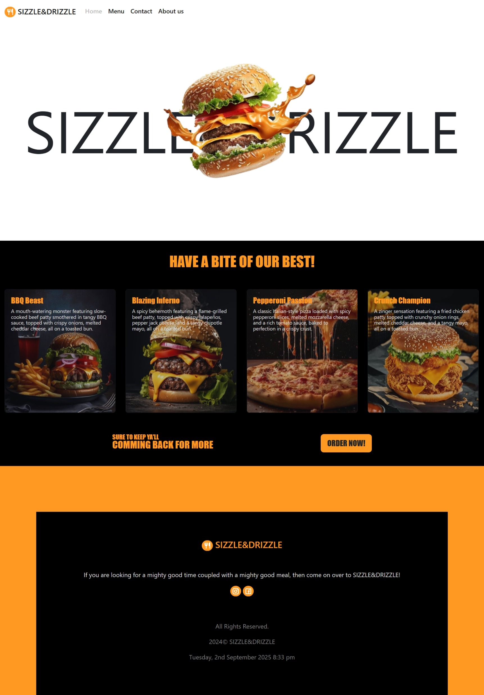
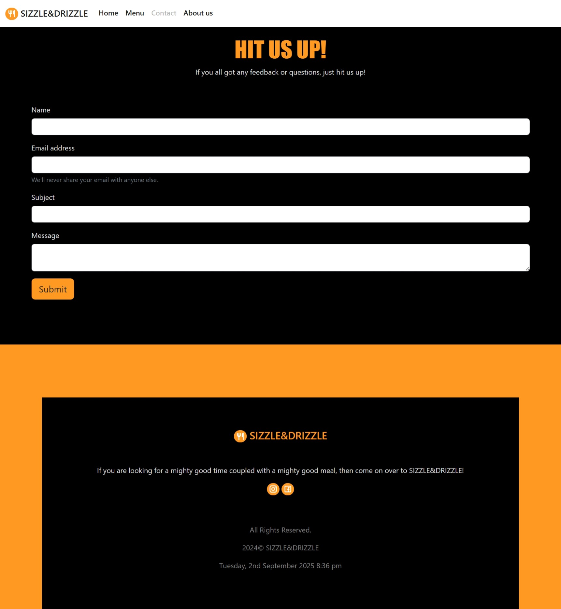

# Sizzle & Drizzle – Restaurant Management System  

A full-stack **PHP & MySQL** powered restaurant management system designed to handle menus, orders, and customer interactions for **Sizzle & Drizzle**.  
This project demonstrates CRUD operations, database handling with PDO, responsive frontend with Bootstrap, and dynamic features like contact forms and image resizing.  

---

## Features  

- **Dynamic Menu Display** – Browse food items stored in MySQL, with images and descriptions.  
- **Order System** – Place food orders with contact & address validation.  
- **Image Upload & Resize** – Upload menu images with auto-resizing into multiple formats (display, card, menu-card).  
- **Contact Form** – Customers can send inquiries via email (PHP mail).  
- **Admin Panel (Manage Menu)** – Add new dishes, descriptions, and prices.  
- **Responsive UI** – Built with **Bootstrap 5**, Font Awesome, and Remix Icons.  
- **Secure Database Handling** – PDO with prepared statements to prevent SQL injection.  

---

## Preview  

- **Home Page**  
    

- **Menu Page**  
    

- **Admin Page**  
    

- **Contact US Page**  
    

---

## 🛠️ Technologies Used  

- **Frontend:** HTML5, CSS3, Bootstrap 5, Font Awesome, Remix Icons  
- **Backend:** PHP 8  
- **Database:** MySQL / MariaDB   (with PDO)
- **Tools:** XAMPP 
- **Other:** PHP Mail, Image GD Library (for resizing), Regex Validation  

---

## Prerequisites

- PHP 7.4+ (PHP 8 recommended) with GD and PDO extensions enabled.  
- MySQL / MariaDB.  
- XAMPP (or your preferred Apache + PHP + MySQL stack).

---

## What I Learned 

- How to set up **PDO with prepared statements** for secure database interactions.
- Creating a **modular PHP project structure** using includes/.
- Handling **file uploads and image resizing** with PHP GD library.
- Building a **responsive UI with Bootstrap 5**.
- Implementing **form validation** with **regex & sanitization**.

---

## Author
**Yusra Yaseen**  

- GitHub: [@Yus-raa](https://github.com/Yus-raa)  
- LinkedIn: [Yusra Yaseen](https://www.linkedin.com/in/yusra-yaseen)  

---
